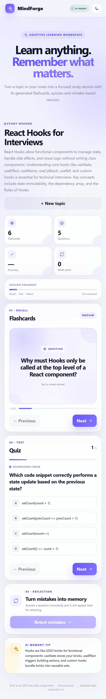
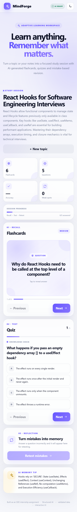
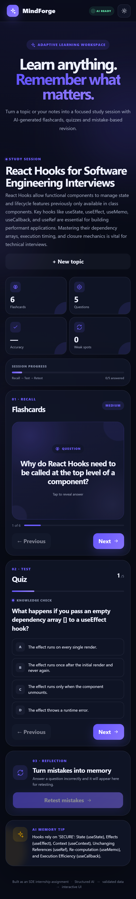

# 🧠 MindForge — Adaptive AI Study Workspace

> Turn free-form study notes into an interactive learning session with AI-generated flashcards, quizzes, and mistake-based revision.

MindForge is a React + Node.js internship assignment project focused on reliable AI integration, structured output validation, and interactive learning UX.

---

## ✨ Features

- 🧠 AI-generated study sessions from free-form input
- 🃏 Interactive flashcards
- 📝 Interactive quizzes with scoring
- 🎯 Wrong-answer tracking
- 🔁 Mistake-based retest mode
- 📊 Learning progress and weak-spot tracking
- 🛡️ Runtime validation of AI-generated JSON
- ⚡ Loading, timeout, retry and error handling
- ❌ Request cancellation for stale/older requests
- 📱 Responsive UI
- 🌙 Optional dark mode
- 🔐 API key kept server-side
- 🧪 Demo fault mode for malformed AI responses

---

## 📸 Screenshots

### Study Workspace



### Generated Study Session



### Dark Mode



---

## 🏗️ Architecture

```text
┌─────────────────────────┐
│       React UI          │
│ Flashcards / Quiz / UI  │
└────────────┬────────────┘
             │
             │ POST /api/study-session
             ▼
┌─────────────────────────┐
│    Node + Express       │
│ Request handling        │
│ Error handling          │
└────────────┬────────────┘
             │
             ▼
┌─────────────────────────┐
│       Gemini API        │
│   Structured JSON       │
└────────────┬────────────┘
             │
             ▼
┌─────────────────────────┐
│ JSON Parsing + Runtime  │
│       Validation        │
└────────────┬────────────┘
             │
             ▼
┌─────────────────────────┐
│   Interactive Session   │
│ Flashcards → Quiz →     │
│ Retest mistakes         │
└─────────────────────────┘
```

The API key stays on the server and is never bundled into the browser.

---

## 🛠️ Tech Stack

| Layer | Technology |
|---|---|
| Frontend | React + Vite |
| Backend | Node.js + Express |
| AI | Google Gemini API |
| Data Validation | Runtime schema validation |
| Styling | CSS |
| Development | npm |

---

## 📚 Learning Flow

```text
Topic / Notes
     ↓
Generate Study Session
     ↓
AI-generated structured content
     ↓
Flashcards
     ↓
Quiz
     ↓
Wrong answers identified
     ↓
Retest mistakes
```

The goal is not only to generate AI content, but to transform the generated data into a controlled and interactive learning workflow.

---

## 🧠 Why Structured AI Output?

Instead of trusting free-form model text, MindForge requests structured data and validates it before rendering.

The generated session follows a predictable structure:

```text
Session
├── Title
├── Summary
├── Flashcards[]
└── Quiz[]
```

This allows the frontend to work with predictable data and prevents malformed AI responses from directly breaking the UI.

---

## 🚀 Getting Started

### Requirements

- Node.js 20+ recommended
- A Gemini API key

### 1. Install dependencies

```bash
npm install
```

### 2. Create your environment file

Create `.env` from `.env.example`.

On Windows, simply copy:

```text
.env.example → .env
```

Then add your Gemini API key:

```env
GEMINI_API_KEY=your_key_here
```

### 3. Start the application

```bash
npm run dev
```

Open the Vite URL shown in the terminal, normally:

```text
http://localhost:5173
```

---

## 🧪 Failure Handling

MindForge deliberately handles unreliable AI output instead of rendering model responses blindly.

The application handles:

- Missing API key
- Provider HTTP errors
- Request timeout
- Empty model output
- Malformed JSON
- Incorrect JSON structure
- Empty flashcards or quiz
- Invalid quiz options
- Invalid correct-answer index
- Cancelled/stale frontend requests

### Demo malformed JSON

The assignment includes a bad-output requirement. MindForge provides a safe demo mode for testing this behavior.

Set:

```env
DEMO_FAULT_MODE=malformed-json
```

Restart the server and click **Generate Study Session**.

The UI should display a recoverable error instead of crashing.

After testing, restore:

```env
DEMO_FAULT_MODE=off
```

---

## 🔄 Request Lifecycle

The frontend tracks the AI request lifecycle:

```text
Idle
  ↓
AI Thinking
  ↓
Success → Ready
  ↓
Error → Recoverable error state
```

Older requests can also be cancelled so stale responses do not overwrite newer user actions.

---

## 🎯 Mistake-Based Revision

MindForge tracks incorrect quiz answers and allows the user to retest those weak areas.

```text
Quiz
 ↓
Incorrect Answer
 ↓
Weak Spot
 ↓
Retest Mistakes
 ↓
Improved Recall
```

This turns the application from a simple AI content generator into an adaptive learning workflow.

---

## 🖥️ Suggested Demo

For a project walkthrough:

1. Enter a learning topic.
2. Generate a study session.
3. Flip a flashcard.
4. Answer a quiz question correctly.
5. Answer another question incorrectly.
6. Show the updated accuracy and weak-spot count.
7. Open **Retest mistakes**.
8. Toggle dark mode.
9. Demonstrate the malformed-JSON recovery mode.

---

## 📦 Project Structure

```text
mindforge/
│
├── docs/
│   └── screenshots/
│       ├── home.png
│       ├── session.png
│       └── dark-mode.png
│
├── server/
│   ├── index.js
│   └── schema.js
│
├── src/
│   ├── App.jsx
│   ├── main.jsx
│   └── styles.css
│
├── .env.example
├── .gitignore
├── index.html
├── package.json
├── package-lock.json
├── README.md
└── vite.config.js
```

---

## 🛡️ Security

The Gemini API key is stored in the server environment and is not exposed to the browser.

The `.env` file is excluded from Git using `.gitignore`.

Only `.env.example` is included in the repository.

---

## 🏗️ Production-Style Build

Create a production build with:

```bash
npm run build
```

For deployment, keep the backend API running and serve the generated frontend using the preferred static hosting/deployment setup.

---

## ⚠️ Known Limitations

- Sessions are not persisted after page reload.
- No authentication.
- AI-generated content is not guaranteed to be factually perfect.
- No streaming is implemented in the core version because reliability and the assignment's time constraint were prioritized.

---

## 🤖 AI Usage

AI assistants may be used for scaffolding, debugging, documentation, and prompt refinement.

The final implementation should be understood and manually reviewed by the author.

---

## 📌 Project Status

Built as an SDE internship assignment with a focus on:

**Structured AI → Validated Data → Reliable Interactive UI**